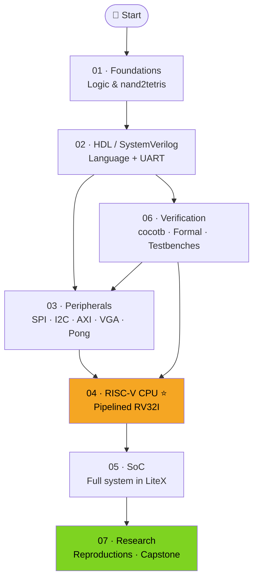

# 🔧 FPGA Journey

> A structured, solo learning path from digital logic foundations to FPGA engineer and researcher — built in public.

Everything here is reproducible with **free tools and online resources**. No university. No lab. No budget required until you want physical hardware.

---

## 🗺️ The Map

> **Verification (06)** is not a phase you finish — it's a skill you build continuously alongside design work.

---

## 📦 Repositories

| # | Repo | What it covers | Status |
|---|------|---------------|--------|
| 01 | [fpga-01-foundations](https://github.com/umairahmadh/fpga-foundations) | Digital logic · Boolean algebra · FSMs · nand2tetris | 🔲 |
| 02 | [fpga-02-hdl-sv](https://github.com/umairahmadh/fpga-hdl-sv) | SystemVerilog fundamentals · HDLBits exercises · UART | 🔲 |
| 03 | [fpga-03-peripherals](https://github.com/umairahmadh/fpga-peripherals) | SPI · I2C · FIFO · AXI-Stream · VGA · Pong | 🔲 |
| 04 | [fpga-04-riscv-cpu](https://github.com/umairahmadh/fpga-riscv-cpu) ⭐ | Pipelined RV32I RISC-V core · riscv-tests | 🔲 |
| 05 | [fpga-05-soc](https://github.com/umairahmadh/fpga-soc) | SoC integration · LiteX · Running C on your own CPU | 🔲 |
| 06 | [fpga-06-verification](https://github.com/umairahmadh/fpga-verification) | cocotb · SymbiYosys formal · Testbench patterns | 🔲 |
| 07 | [fpga-07-research](https://github.com/umairahmadh/fpga-research) | Paper reproductions · Capstone · Writeups | 🔲 |

Status: 🔲 Not started · 🟡 In progress · ✅ Complete

---

## 🛠️ Tools Used

| Category | Tool | Free? |
|----------|------|-------|
| HDL simulation | Verilator, Icarus Verilog, GTKWave | ✅ |
| Python testbenches | cocotb | ✅ |
| Formal verification | SymbiYosys + Yosys | ✅ |
| Synthesis (open-source) | Yosys + nextpnr | ✅ |
| Synthesis (vendor) | AMD Vivado WebPACK | ✅ |
| SoC builder | LiteX | ✅ |
| Python HDL | Amaranth HDL | ✅ |
| RISC-V toolchain | riscv-gnu-toolchain, Spike | ✅ |
| Board (optional) | iCEBreaker / Arty A7-100T | 💰 |

---

## 📖 Key Learning Resources

- **[HDLBits](https://hdlbits.01xz.net)** — interactive SystemVerilog exercises
- **[nand2tetris](https://www.nand2tetris.org)** — build a computer from NAND gates
- **[ZipCPU Blog](https://zipcpu.com)** — FPGA design + formal verification depth
- **[Project F](https://projectf.io)** — graphics and display FPGA projects
- **[nandland](https://nandland.com)** — beginner-friendly FPGA tutorials
- *Digital Design and Computer Architecture* — Harris & Harris
- *Computer Organization and Design: RISC-V edition* — Patterson & Hennessy

---

## 🧭 How to Follow This Journey

Each sub-repo is self-contained. Every project inside one includes:
- ✅ A working testbench with self-checking assertions
- ✅ Waveform screenshots (GTKWave or cocotb)
- ✅ A block diagram in the README
- ✅ Build/simulate instructions you can run yourself
- ✅ A short writeup of what was learned and what could be improved

If you're learning too, feel free to fork any repo and use it as a starting structure.

---

## 🔄 Progress Log

| Date | Milestone |
|------|-----------|
| 30.05.2025 | Started the journey |

---

## 📄 License

All code MIT licensed. All writeups CC BY 4.0. Use, fork, share freely.
